# 情緒聲量投資交易 — 方法與結果說明

這份文件把 `情緒聲量投資交易.ipynb` 從頭到尾講一遍：資料怎麼來、怎麼清、怎麼做特徵、模型怎麼訓練跟驗證、效能如何，以及最後怎麼把預測變成可回測的交易策略。所有數字都取自 notebook 的實際執行輸出，圖則對應 `figures/`。

> 為了讓結果可重現，台積電價格在第一次下載後會快取為 `price_2330.csv`，之後每次執行都讀同一份資料、數字固定。

整條流程：**資料收集 → 前處理 → 特徵工程 → 模型訓練 → 效能評估 → 非監督分群 → 回測應用**。

- 監督式模型：Logistic Regression、Random Forest，並用多數類別當 baseline。
- 非監督式模型：K-Means 市場情緒分群、PCA 降維。
- 問題型態：二元分類，預測隔日收盤相對今日是漲（1）還是跌（0）。

---

## 一、資料收集

資料來源有兩個：

1. **情緒聲量資料**：PTT 股票版的貼文，透過大型語言模型（GPT-3.5-turbo 與 gpt-4o-mini）對每篇貼文做情緒分類（正／中／負），再依股票跟交易日彙總起來。原始貼文取自 PTT 公開看板。
2. **股價資料**：Yahoo Finance，透過 `yfinance` 套件抓台積電 2330.TW 的日線（第一次下載後快取為 `price_2330.csv`）。

問題定義是監督式二元分類，用「開盤前（09:00）」的情緒聲量特徵去預測台積電隔日漲跌，目標變數 `target` 在隔日收盤上漲時為 1、下跌或持平時為 0。

> **避免未來函數**：原始情緒資料分 `0000`（全日）與 `0900`（開盤前）兩版，這裡採用 `0900`，確保特徵在交易日開盤前就能取得，避免 look-ahead bias。

讀進來後：情緒原始資料 **1,700** 列（2019-01-02 ~ 2025-12-30），股價 **1,698** 個交易日。

---

## 二、資料庫說明（Schema）

### 2.1 原始檔 `drive_data/`

每篇貼文先由 LLM 標情緒、再依「股票代號 × 交易日」彙總，存成 4 個 CSV（各約 7 MB，含多檔股票，用 `id` 欄篩選）：

| | 0000（全日） | 0900（開盤前） |
|---|---|---|
| **GPT-3.5-turbo** | 對照 | 對照 |
| **gpt-4o-mini** | — | **主模型（實際採用）** |

另有原始貼文 `ptt.stock20260520.json`（約 2.7 GB，未進版控）。

### 2.2 前處理後資料集 `情緒聲量_2330_前處理資料集.csv`

以 `id=2330` 篩出台積電、與 yfinance 價格依日期 inner join 後，得到 **1,696 列 × 26 欄**。主要欄位：

| 欄位 | 型態 | 說明 |
|---|---|---|
| `trading_date` | 日期 | 交易日 |
| `sum_count` | 整數 | 當日貼文總數，也就是聲量 |
| `positive_count` / `neutral_count` / `negative_count` | 整數 | 正／中／負面貼文數 |
| `daily_mean_score` | 浮點 | 當日情緒均分（約 -0.7 ~ +0.8） |
| `positive_count/sum_count` 等 | 浮點 | 各情緒佔比 |
| `score_gpt35` / `buzz_gpt35` | 浮點 | 對照模型（GPT-3.5）的情緒與聲量 |
| `Open` / `High` / `Low` / `Close` / `Volume` | 浮點 | 台積電日線價量 |
| `ret_next` | 浮點 | 隔日報酬（建標籤用） |
| `target` | 0/1 | 隔日漲跌標籤（預測目標） |

---

## 三、資料前處理

### 3.1 資料清洗

- 缺失值 **0**、重複交易日 **0**。
- 聲量（`sum_count`）右偏，用 IQR 法檢查異常值，上界 41.5、超過比例 5.59%。**這些高聲量日決定保留**，因為它們通常對應重大事件，正是策略要關注的訊號，不該刪掉。

### 3.2 建立標籤

```python
df["ret_next"] = df["Close"].shift(-1) / df["Close"] - 1   # 隔日報酬
df["target"]   = (df["ret_next"] > 0).astype(int)           # 隔日上漲=1
```

合併後樣本 **1,696**；目標變數近平衡：跌(0) 50.7%、漲(1) 49.3%。

### 3.3 特徵縮放與編碼

- **Logistic Regression** 對尺度敏感 → 用 `StandardScaler` 標準化。
- **Random Forest** 是樹模型、用分裂點切割，不受單調縮放影響 → 不縮放。
- **K-Means** 基於歐氏距離 → 分群時才標準化。
- 特徵幾乎都是數值型，不需要 One-Hot／Label Encoding。

---

## 四、特徵工程

把原始的聲量跟情緒轉成更有預測力的特徵，最後得到 **15 個特徵**：

| 特徵 | 定義 / 計算 | 用意 |
|---|---|---|
| `buzz_log` | `log1p(sum_count)` | 聲量右偏 → 數學轉換 |
| `buzz_ma3` / `buzz_ma5` | 聲量 3 日 / 5 日均 | 平滑 |
| `buzz_mom` | 今日聲量 ÷ 5 日均 | 抓討論熱度突然升溫 |
| `score_ma3` | 情緒 3 日均 | 平滑 |
| `score_mom` | 今日情緒 − 3 日均 | 情緒動能 |
| `pos_ratio` / `neg_ratio` / `neu_ratio` | 各情緒佔比 | 情緒結構 |
| `pos_neg_diff` | `pos_ratio − neg_ratio` | 多空情緒淨值 |
| `model_disagree` | `|4o-mini 情緒 − GPT-3.5 情緒|` | 標註不確定性 |
| `ret_prev` | 前一日報酬 | 價格輔助 |
| `vol_chg` | 成交量 ÷ 5 日均量 | 量能比 |
| `daily_mean_score` / `sum_count` | 原始情緒均分 / 聲量 | 基礎訊號 |

> **小巧思**：沒有把「用哪個 GPT 模型」直接做 One-Hot，而是轉成兩模型情緒分數差的絕對值（`model_disagree`），變成一個有意義的數值特徵，代表該日標註的不確定性。

最後建模樣本 **1,692**、特徵數 **15**。

### EDA：資料探索與視覺化

**股價 vs 聲量時間序列**

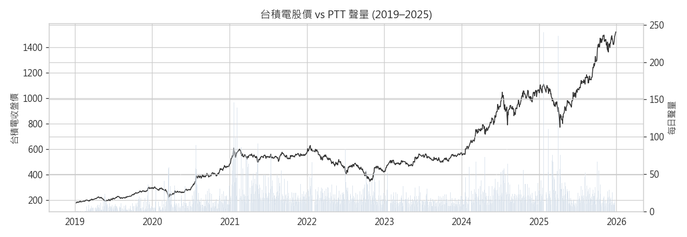

聲量在大跌或大漲時會明顯放大（像 2020 疫情、2022 空頭），爆量常常伴隨高波動，呼應「聲量 = 市場情緒強度」這個假設。

**單變量分布**

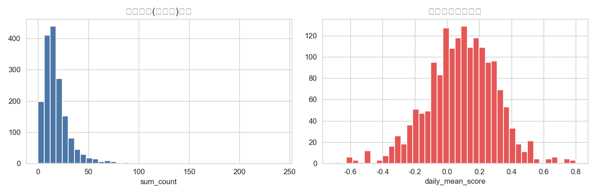

聲量明顯右偏，多數日子只有 10 到 20 篇、少數爆量日會到 200 篇以上（所以才取 log）；情緒均分集中在 0 附近、略偏正，看得出 PTT 對台積電整體中性偏多。

**聲量 / 情緒 vs 隔日漲跌**

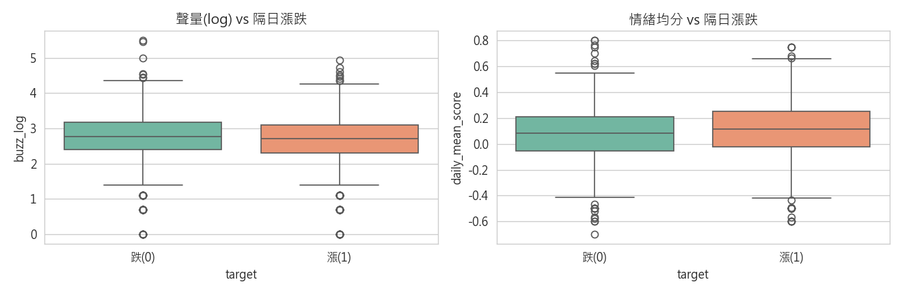

上漲日的當日情緒均分中位數略高於下跌日，不過兩者重疊得很嚴重，情緒對隔日方向只有很弱的正向關係。

**相關矩陣**

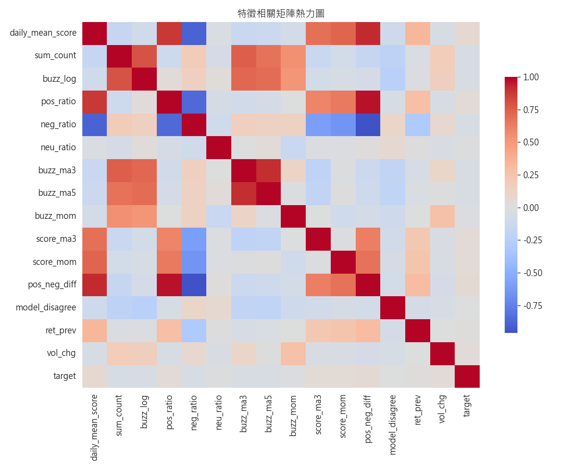

所有情緒特徵跟 `target` 的相關係數都很低（|r| < 0.07，最高是 `daily_mean_score` 0.068、`sum_count` 0.057），符合「股市隔日方向雜訊很高」的金融常識；聲量類特徵彼此高度相關（多重共線性），對線性模型不利，但對樹模型影響不大。

---

## 五、特徵選擇與降維

用三種方法交叉檢視：

- **互信息（Filter）**：`score_ma3`（0.047）、`pos_neg_diff`（0.025）資訊量最高，情緒動能類勝出。
- **RFE（Wrapper）**：選出 8 個以情緒為主的特徵（`daily_mean_score`, `sum_count`, `pos_ratio`, `buzz_ma3`, `buzz_ma5`, `score_ma3`, `score_mom`, `vol_chg`）。
- **樹重要性（Embedded）**：事後用 RF 特徵重要性檢驗。

**決策**：最後保留全部 15 個特徵丟給樹模型（它本身就有特徵選擇能力）。

**PCA 降維**

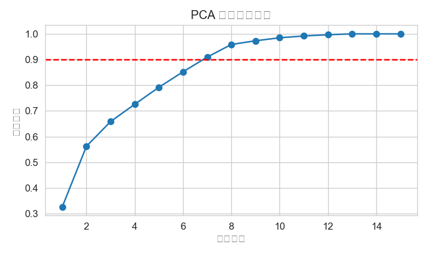
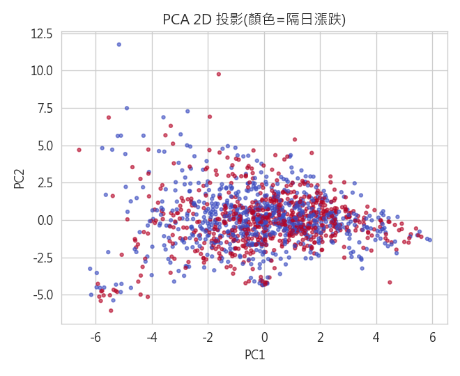

前 2 個主成分只解釋了 **56.2%** 的變異，要到 90% 得用上 **7** 個主成分；2D 投影裡漲跌樣本重疊得很厲害，再次說明線性可分性很低，所以主力用非線性的隨機森林。

---

## 六、模型訓練

| 設定 | 內容 |
|---|---|
| Baseline | `DummyClassifier(strategy="most_frequent")` |
| 主力模型 | Logistic Regression（線性、好解釋）、Random Forest（非線性、抗雜訊） |
| 資料分割 | 時間序列：前 80% 訓練、後 20% 測試，**不可隨機打亂** |
| 交叉驗證 | `TimeSeriesSplit`（5 折），驗證集永遠在訓練集之後 |
| 超參數調校 | `GridSearchCV`，以 ROC-AUC 為準則 |
| 類別不平衡 | ≈ 49/51 輕微不平衡，統一 `class_weight="balanced"` |

調參結果：

- Logistic Regression 最佳 `C=0.01`，CV-AUC = **0.506**。
- Random Forest 最佳 `max_depth=8, min_samples_leaf=1, n_estimators=100`，CV-AUC = **0.550**。

---

## 七、模型效能評估

主要看 ROC-AUC（對門檻不敏感、適合接近平衡的資料），搭配混淆矩陣、Precision／Recall／F1。

| 模型 | Accuracy | Precision | Recall | F1 | ROC-AUC |
|---|---|---|---|---|---|
| Baseline（多數類別） | 0.507 | 0.000 | 0.000 | 0.000 | 0.500 |
| Logistic Regression | 0.525 | 0.524 | 0.389 | 0.447 | 0.535 |
| **Random Forest** | **0.563** | **0.566** | **0.485** | **0.523** | **0.576** |

Random Forest 在所有指標都最好，明顯比 baseline 跟 LogReg 好；不過 AUC 只比 0.5 高一點，代表情緒聲量對隔日方向的預測力雖然真實存在、但其實很弱。

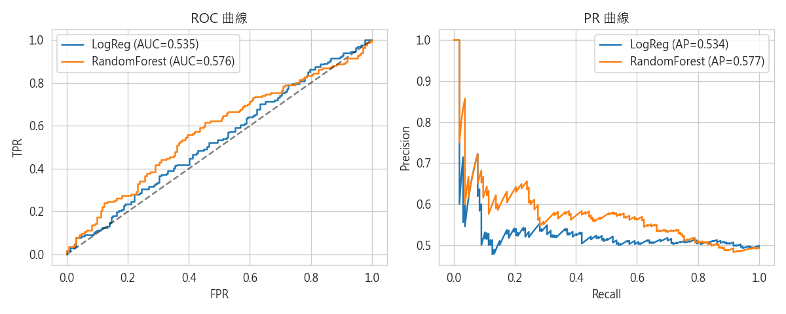

### 誤差分析與可解釋性

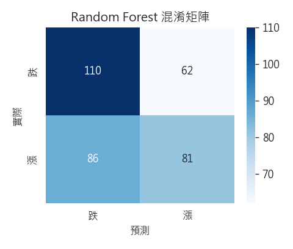
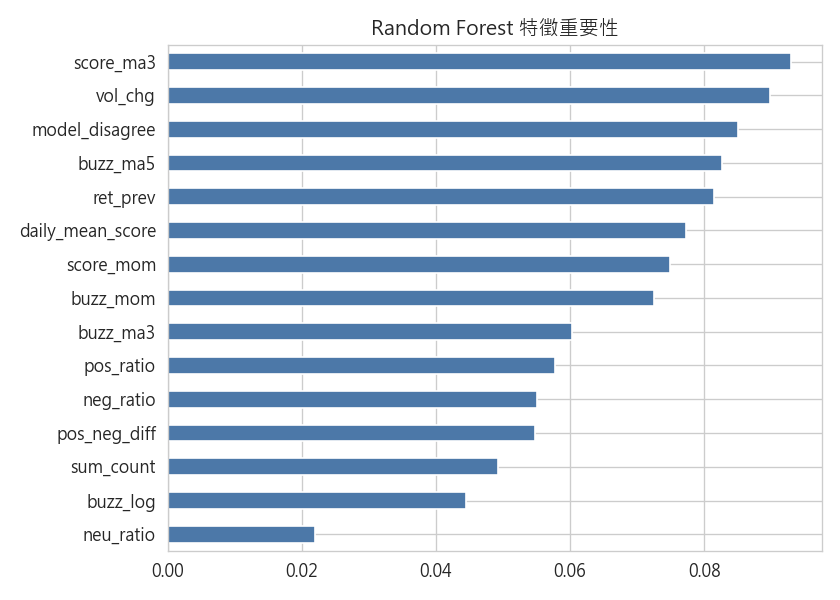

排列重要性（對測試集 AUC）前幾名：`model_disagree`（0.012）、`buzz_mom`（0.011）、`ret_prev`（0.009）、`score_ma3`（0.008）、`buzz_log`（0.007）。聲量與情緒動能類是最重要的特徵，符合「情緒聲量驅動」的直覺。

誤差主要來自盤整期：情緒中性、聲量平淡時模型幾乎是隨機猜；反而在情緒或聲量比較極端的交易日，模型比較有把握——訊號集中在「事件日」。

---

## 八、非監督學習：市場情緒狀態分群（K-Means）

用聲量、情緒、正負差、聲量動能（`buzz_log`, `daily_mean_score`, `pos_neg_diff`, `buzz_mom`）對交易日分群（k=3）。

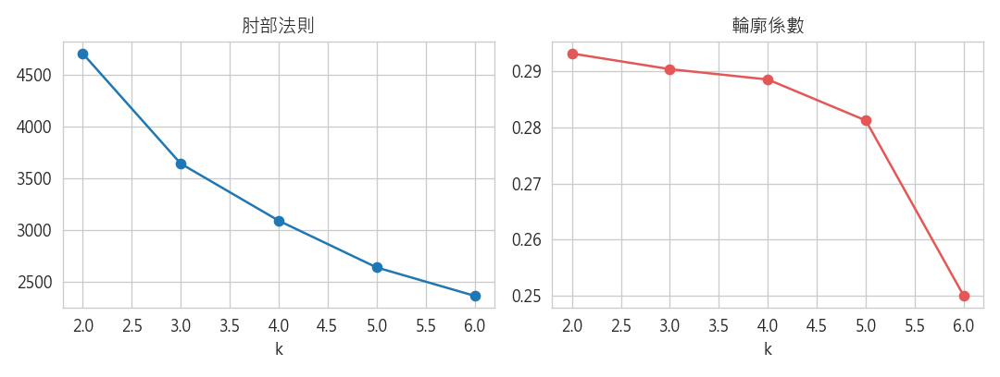
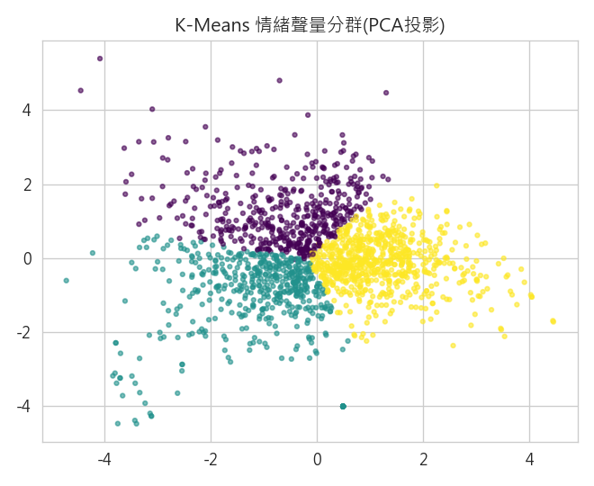

| 群（狀態） | 平均聲量 | 平均情緒 | 隔日上漲率 | 樣本數 |
|---|---|---|---|---|
| 高聲量・中性 | 31.6 | 0.07 | **46.0%** ↓ | 478 |
| 低聲量・偏空 | 12.9 | -0.12 | 47.4% | 496 |
| 正面情緒 | 12.2 | 0.25 | **52.9%** ↑ | 718 |

**關鍵洞察**：正面情緒群的隔日上漲率最高（52.9%），高聲量爆量群反而最低（46.0%），印證了「爆量常出現在恐慌或追高、屬於反向訊號」這個市場經驗。

---

## 九、回測應用

把最佳模型（Random Forest）的預測轉成交易訊號：**預測隔日上漲就持有一天、否則空手**，在測試集回測，並跟「買進持有」對照。

```python
test["signal"]   = pred_rf
test["strat_ret"] = test["signal"] * test["ret_next"]   # 預測漲才參與
```

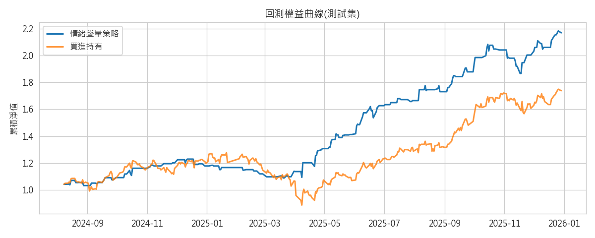

| 指標 | 情緒聲量策略 | 買進持有 |
|---|---|---|
| 總報酬 | 116.9% | 73.9% |
| **Sharpe** | **2.84** | 1.46 |
| **最大回撤** | **-11.4%** | -30.5% |
| 交易筆數（進場 0→1） | **78 筆** | — |
| 做多天數 | 143 / 339（做多日勝率 56.6%） | 339 / 339 |

策略在測試期間只用了約 42% 的時間在場內（做多 143 天、進出 78 筆），靠著在情緒轉差時空手，把最大回撤從 -30.5% 收斂到 -11.4%、Sharpe 幾乎翻倍（2.84 vs 1.46）。

> ⚠️ **總報酬要小心解讀**：因為這個訊號很弱、又接近效率市場，回測「總報酬」對資料切分與模型選擇非常敏感——同一套流程在不同執行下，策略總報酬落在約 **67%～117%** 之間（GridSearch 會在 `max_depth=3` 與 `max_depth=8` 之間擺盪）。所以**不該把總報酬當成穩定結論**。真正穩健、每次執行都成立的是「風險調整後的表現」：Sharpe 永遠遠勝買進持有（約 2.2–2.8 vs 1.46）、最大回撤永遠遠小於買進持有（約 -10~-11% vs -30.5%）。為求可重現，本專案已把價格快取成 `price_2330.csv`，數字固定在上表這一版。

---

## 十、結論

1. **情緒聲量對隔日漲跌有預測力，雖然弱但真實存在**：RF 測試集 ROC-AUC 0.576，比隨機的 0.5 跟線性模型都好。
2. **風險控管的價值大於方向預測（最穩健的結論）**：不管哪一次執行，策略的 Sharpe（2.84）與最大回撤（-11.4%）都顯著優於買進持有（1.46／-30.5%），情緒訊號能讓策略在高風險期空手避險。相對地，「總報酬」不穩定，不宜過度解讀。
3. **聲量是反向指標**：分群顯示爆量日的隔日上漲率反而偏低，符合追高殺低的散戶行為。
4. **全程嚴防資料洩漏**：原始情緒分數雜訊高，所以用動能、比例、滾動特徵去強化訊號；時間序列容易資料洩漏，所以全程用時間分割跟 `TimeSeriesSplit`，而且只用開盤前的資料。

### 限制與未來改進

- 訊號偏弱導致回測總報酬不穩定 → 可改用更穩健的評估（多次切分平均、walk-forward）、或固定模型參數。
- 擴大到多檔股票的面板資料，而非單一台積電。
- 納入更多訊號（新聞情緒、三大法人買賣超）。
- 把預測目標從「隔日方向」改成「5 日報酬」。
- 回測加入交易成本與停損機制（本策略測試期進出 78 筆，成本不可忽略）。

---

## 引用出處

- 股價資料：Yahoo Finance（`yfinance`），已快取為 `price_2330.csv`。
- 情緒聲量資料：PTT 股票版貼文，經 GPT-3.5-turbo 與 gpt-4o-mini 標註後彙總。
- 情緒標註由 LLM 產生，僅用於學術研究；資料皆為公開論壇的每日彙總統計，不含個資。
